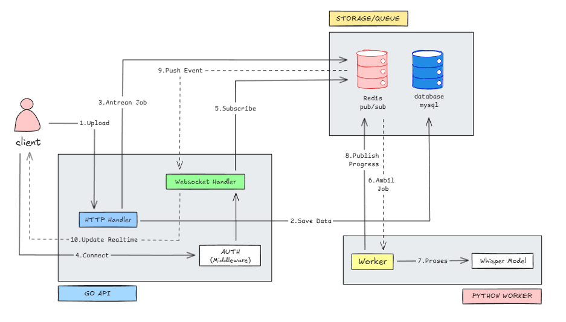

## Architecture System

## Feature System

- JWT Authentication
- File upload
- Redis queue system
- Async processing with Python worker
- Real-time Progress Updates (WebSocket & Redis Pub/Sub)
- Job Cancellation support
- Granular Status Tracking
- Secure Job Ownership validation

## Whisper Model Options

| Model | Size | RAM Required | Speed | Accuracy |
|-------|------|--------------|-------|----------|
| tiny | ~39 MB | ~1 GB | Fastest | Lowest |
| base | ~74 MB | ~1 GB | Fast | Good |
| small | ~244 MB | ~2 GB | Medium | Better |
| medium | ~769 MB | ~5 GB | Slow | Very Good |
| large | ~1550 MB | ~10 GB | Slowest | Best |

**Recommendation:** Use `base` for development, `small` or `medium` for production.

## API Endpoints

- GET `/api/health`
- POST `/api/auth/sign-up`
- POST `/api/auth/sign-in`
- GET `/api/user/profile`
- PUT `/api/user/profile`
- POST `/api/transcribe`
- GET `/api/transcribe/:job_id`
- POST `/api/transcribe/:job_id/cancel`
- GET `/api/transcribe`
- DELETE `/api/transcribe/:job_id`
- WS `/api/ws/job/:job_id`